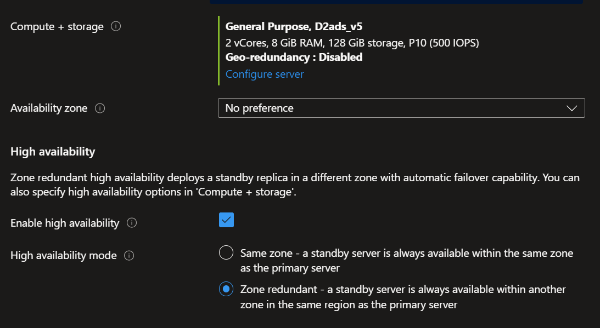
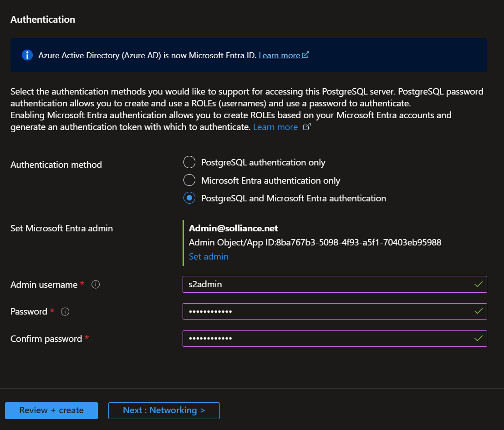
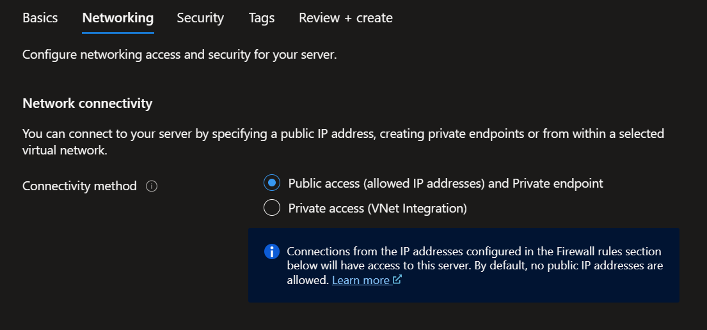
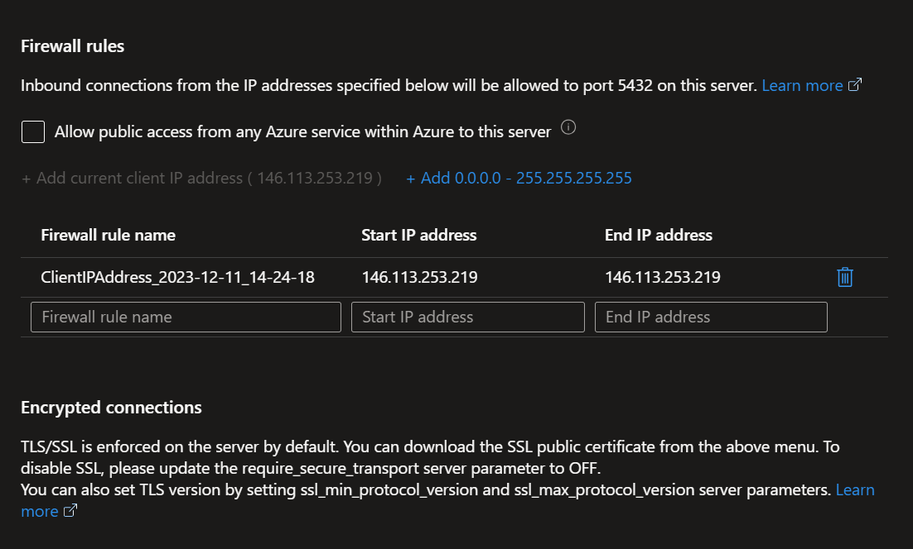
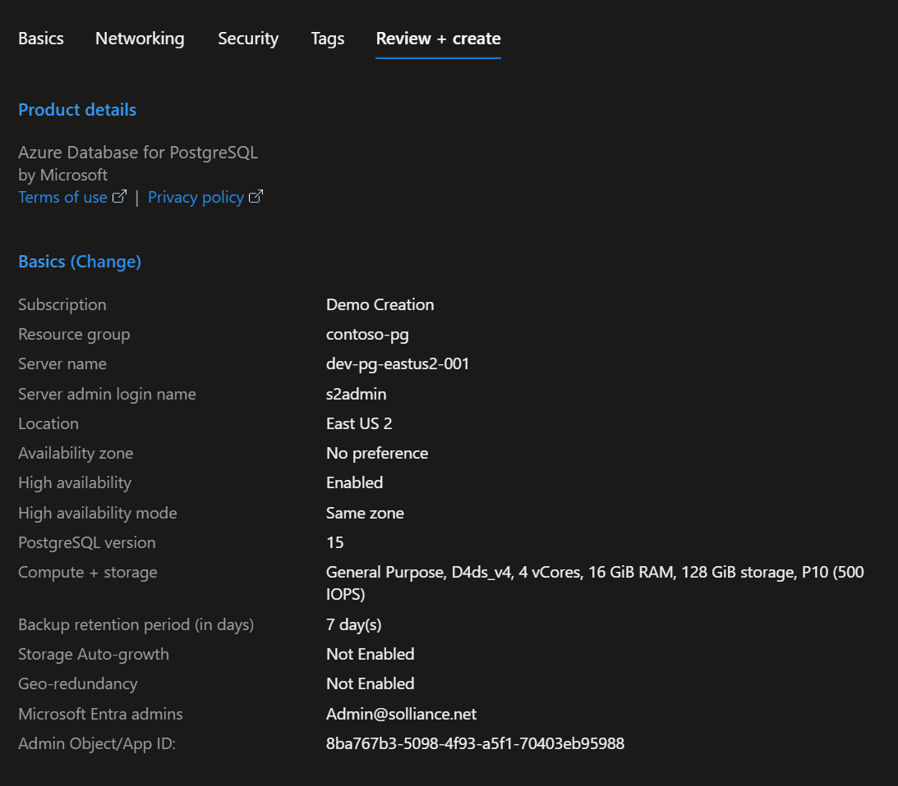
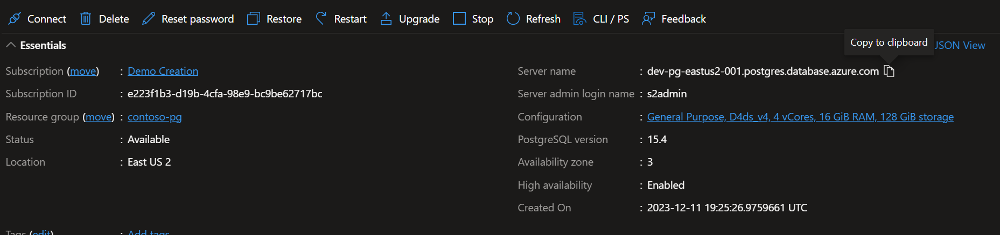

# Hands on Lab: Provisioning, configuring, and getting started with development

- [Hands on Lab: Provisioning, configuring, and getting started with development](#hands-on-lab-provisioning-configuring-and-getting-started-with-development)
  - [Prerequisites](#prerequisites)
  - [Exercise 1: Creating an Azure Database for PostgreSQL - Flexible Server](#exercise-1-creating-an-azure-database-for-postgresql---flexible-server)
  - [Exercise 2: Adding a database in the portal](#exercise-2-adding-a-database-in-the-portal)
  - [Exercise 3: Configuring maintenance](#exercise-3-configuring-maintenance)
  - [Exercise 4: Connecting with pgAdmin](#exercise-4-connecting-with-pgadmin)
    - [Task 1: Networking Setup (Non-Lab Environment - BYOD)](#task-1-networking-setup-non-lab-environment---byod)
    - [Task 2: Networking Setup (Lab Environment)](#task-2-networking-setup-lab-environment)
    - [Task 2: Add Server to pgAdmin](#task-2-add-server-to-pgadmin)
  - [Exercise 5: Writing your first query](#exercise-5-writing-your-first-query)
  - [Summary](#summary)
  - [Miscellaneous (Optional)](#miscellaneous-optional)

In this lab you will create an [Azure Database for PostgreSQL Flexible Server](https://learn.microsoft.com/azure/postgresql/flexible-server/overview) and then configure various properties using the Azure Portal. Once created and configured, you will then connect to it using [pgAdmin](https://www.pgadmin.org/) to run some basic queries on pre-loaded data.

## Prerequisites

- [Azure subscription](https://azure.microsoft.com/free/)
- Optional - Computer with [Postgres 16](https://www.postgresql.org/download/) and [pgAdmin](https://www.pgadmin.org/)

## Exercise 1: Creating an Azure Database for PostgreSQL - Flexible Server

In this exercise you will create a new Azure Database for PostgreSQL Flexible Server using the Azure Portal.

1. Open the [Azure Portal](https://portal.azure.com/), if prompted, login using your lab credentials.
2. Select **Create a resource (+)** in the upper-left corner of the portal or select **Create a resource** under **Azure services**.

    

3. In the left side navigation, select **Databases**.
4. Under **Azure Database for PostgreSQL Flexible Server**, select **Create**.

    

5. Fill out the Basics tab with the following information, be sure to replace `PREFIX` with your lab information (ex `1224900`) or a unique prefix such as your initials (ex `ABC`), also replace the `REGION`:

   - Resource Group: Name of your lab resource group (ex `postgres`)
   - Server name:  `PREFIX-pg-flex-REGION-16`
   - Region: `REGION`
   - PostgreSQL Version: `16`
   - Workload Type: `Production (Small/Medium-size)`
  
    

6. Under **Compute + Storage**, select **Configure Server**.
7. For the size, select `Standard_D2ds_v5`.
8. Please **DO NOT** select the **High Availability** option as it is subject to availability and capacity limits in various regions.

    
  
9. Select **Save**.
10. Authentication method: `PostgreSQL authentication only`.
11. Admin username: `s2admin`.
12. Password and confirm password: `Seattle123Seattle123`.

    

13. Select **Next: Networking**. On the Networking tab, you can choose how your server is reachable.
14. Configure Networking options:
  
    - Select **Public access (allowed IP addresses)**

      

    - Add your client IP address to ensure you can connect to your new instance

        > NOTE: You can find your IP Address by using a service such as [What Is My IP Address](https://whatismyipaddress.com/)

    - Additionally, select the **Allow public access from any Azure service with Azure to the server**

    

15. Select **Review + create** to review your selections.

    

16. Select **Create** to provision the server. This operation may take a few minutes.
17. In the top right of the toolbar, select the Notifications icon (a bell).

      

18. Select **Deployment in progress** link.  You can now monitor the deployment process:

      

- Once deployed, select the link to navigate to your server's **Overview** page.
  - Make a note of the Server name and the Server admin login name.
  - Hover your cursor over each field, and the copy symbol appears to the right of the text.
  - Select the copy symbol as needed to copy the values for use later:
    - Subscription ID
    - Resource Group
    - Resource name
    - Server name

  

## Exercise 2: Adding a database in the portal

In this exercise you will use the Azure Portal to add a new database to your newly created Azure Database for PostgreSQL Flexible Server.

1. Browse to the new **PREFIX-pg-flex-REGION-16** instance.
2. Under **Settings**, select **Databases**.
3. In the menu, select **+Add**.
4. For the name, type **airbnb**.

    

5. Select **Save**.

## Exercise 3: Configuring maintenance

In this exercise you will modify the [maintenance schedule](https://learn.microsoft.com/azure/postgresql/flexible-server/concepts-maintenance) of your Azure Database for PostgreSQL Flexible Server. By changing the schedule you can match the Azure update schedule to your own internal update schedule.

1. Browse to the **PREFIX-pg-flex-REGION-16** instance.
2. Under **Settings**, select **Maintenance**.
3. Select **Custom schedule**.
4. For the **Day of week**, select **Saturday**.
5. For the **Start time (UTC)**, select **23**.
  
      

6. Select **Save**.

## Exercise 4: Connecting with pgAdmin

If you have a laptop or desktop that has pgAdmin and PostgreSQL installed, you can perform these steps on that device. If you do not have a local device capable of running pgAdmin or PostgreSQL, you can utilize the virtual machine that was deployed to your lab environment.

### Task 1: Networking Setup (Non-Lab Environment - BYOD)

If you are using your own device, ensure the following has been completed:

1. Download and Install [pgAdmin](https://www.pgadmin.org/download/).
2. Download and Install [PostgreSQL 16](https://www.postgresql.org/download/).
3. Switch back to the Azure Portal.
4. Browse to the `PREFIX-pg-flex-REGION-16` instance.
5. Under **Settings**, select **Networking**.
6. Ensure that the **Allow public access from any Azure service within Azure to this server** checkbox in selected.
7. Under **Firewall rules**, add an entry for the IP address of your device.

    > NOTE: You can find your IP Address by using a service such as [What Is My IP Address](https://whatismyipaddress.com/)

8. Select **Save**.
9. Repeat for the `PREFIX-pg-flex-REGION-14` instance. Note that this instance was created by the lab ARM template for you.

### Task 2: Networking Setup (Lab Environment)

If you are using the virtual machine from the lab environment, all the software has been installed for you. Login using the following:

1. Switch to the Azure Portal.
2. Browse to your resource group.
3. Select the **PREFIX-vm-pgdb01** virtual machine.
4. In the tabs, select **Connect->Connect**.
5. Copy and save the IP address.
6. Select **Download RDP file**.
7. Open the RDP file with Remote Desktop.
8. Select **Connect**.
9. Login with `s2admin` and password `Seattle123Seattle123`.
10. When prompted, select **Next**, then **Accept**.
11. Switch back to the Azure Portal.
12. Browse to the `PREFIX-pg-flex-REGION-16` instance.
13. Under **Settings**, select **Networking**.
14. Ensure that the **Allow public access from any Azure service within Azure to this server** checkbox in selected.
15. Under **Firewall rules**, add an entry using the IP address you copied above.

    > NOTE: You can find your IP Address by using a service such as [What Is My IP Address](https://whatismyipaddress.com/)

16. Select **Save**.
17. Repeat the networking steps for the `PREFIX-pg-flex-REGION-14` instance. Note that this instance was created by the lab ARM template for you.

### Task 2: Add Server to pgAdmin

1. From the lab virtual machine, open **pgAdmin**.
2. Right-click the **Servers** node, select **Register->Server**.
  
    

3. For name, type **PREFIX-pg-flex-REGION-16**, be sure to replace `PREFIX` with your lab information.
4. Select the **Connection** tab.
5. For the **host name/address**, paste the server name you copied from above.
6. For the username, type **s2admin**.
7. For the password, type **Seattle123Seattle123**.
8. Select **Save password?** to toggle it on.
9. Select **Save**.
10. Again, repeat for the **PREFIX-pg-flex-REGION-14** instance.

## Exercise 5: Writing your first query

Using pgAdmin, you will execute some basic queries

1. Switch to pgAdmin.
2. Expand the **PREFIX-pg-flex-REGION-14** node.
3. Expand the **Databases** node.
4. Expand the **airbnb->Schemas->public** nodes.

    > NOTE:  If for some reason you do not see the **airbnb** table, use `psql` to run the script in the `"c:\labfiles\microsoft-postgres-docs-project\artifacts\data\airbnb.sql"`

5. Expand the **Tables** node.
6. Right-click the new `airbnb` table, select **Query Tool**.
7. Copy the following into the query tool window and execute it:

    ```sql
    select * 
    from listings;
    ```

    

## Summary

In this lab, you created a new Azure Database for PostgreSQL Flexible Server instance, configured some various aspects of it, added a database called `airbnb`, configured a custom maintenance schedule then explored some data using on a secondary PG14 instance using pgAdmin.

In the next set of labs, you will explore several developer and performance features of PostgreSQL.

## Miscellaneous (Optional)

If you would like to run these labs in your own Azure subscription, you will need to execute the following steps using the provided ARM template:

1. Switch to the Azure Portal.
2. Select the **+** in the top left.
3. Search for **template**, select the **Template deployment (deploy using custom templates).
4. Select **Create**.
5. Select **Build your own template in the editor**.
6. Copy and paste the `/artifacts/environment-setup/automation/template.json` file into the window.
7. Select **Save**.
8. Set the **prefix** parameter to match your lab environment or your initials (ex `ABC`).
9. Select **Review + create**.
10. Select **Create**, the deployment will take a few minutes.  Once deployed, you will have:
    - A PostgreSQL 14 instance.
    - Windows 11 Virtual Machine with necessary software installed.
    - Various Azure supporting services
