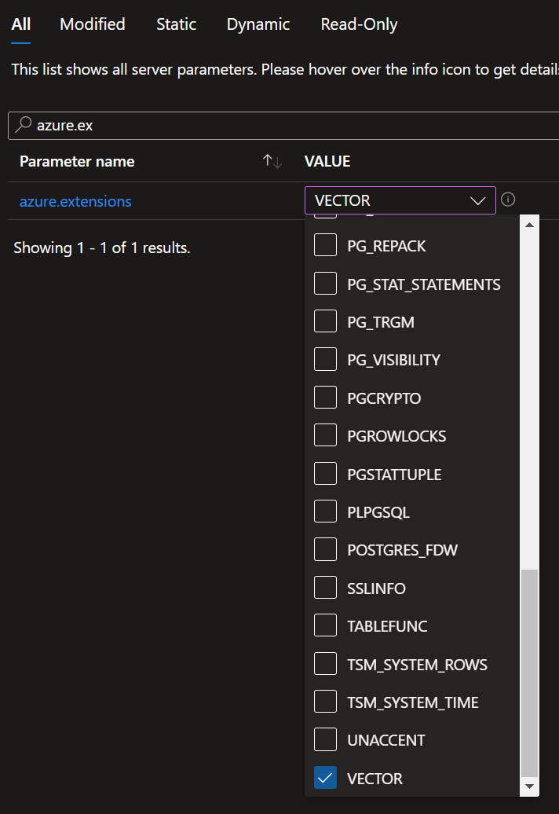
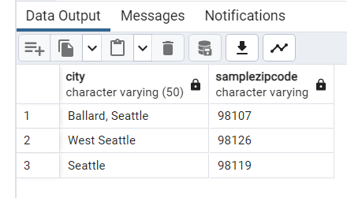

# Hands on Lab: Working with the latest capabilities of Postgres 16

- [Hands on Lab: Working with the latest capabilities of Postgres 16](#hands-on-lab-working-with-the-latest-capabilities-of-postgres-16)
  - [Prerequisites](#prerequisites)
  - [Exercise 1: Setup](#exercise-1-setup)
    - [Task 1: Create tables and data](#task-1-create-tables-and-data)
  - [Task 2: Configuring a server parameters](#task-2-configuring-a-server-parameters)
  - [Exercise 2: Developer Features](#exercise-2-developer-features)
    - [Task 1: Add SQL/JSON object checks](#task-1-add-sqljson-object-checks)
    - [Task 2: Add SQL/JSON constructors](#task-2-add-sqljson-constructors)
    - [Task 3: Aggregate function ANY\_VALUE()](#task-3-aggregate-function-any_value)
    - [Task 4: COPY batch\_size support](#task-4-copy-batch_size-support)
    - [Task 5: Allow a COPY FROM value to map to a column's DEFAULT](#task-5-allow-a-copy-from-value-to-map-to-a-columns-default)
  - [Exercise 3: Infra Features](#exercise-3-infra-features)
    - [Task 1: New options for CREATE USER](#task-1-new-options-for-create-user)
    - [Task 2: Allow parallelization of FULL and internal right OUTER hash joins](#task-2-allow-parallelization-of-full-and-internal-right-outer-hash-joins)
    - [Task 3: Allow aggregate functions string\_agg() and array\_agg() to be parallelized](#task-3-allow-aggregate-functions-string_agg-and-array_agg-to-be-parallelized)
    - [Task 4: Add EXPLAIN option GENERIC\_PLAN to display the generic plan for a parameterized query](#task-4-add-explain-option-generic_plan-to-display-the-generic-plan-for-a-parameterized-query)
    - [Task 5: Use new VACUUM options to improve VACUUM performance](#task-5-use-new-vacuum-options-to-improve-vacuum-performance)
    - [Task 6: Using pg\_stat\_io for enhanced IO monitoring](#task-6-using-pg_stat_io-for-enhanced-io-monitoring)
  - [Exercise 3: PgBouncer](#exercise-3-pgbouncer)
    - [Task 1: Enable PgBouncer](#task-1-enable-pgbouncer)
    - [Task 2: Performance without PgBouncer](#task-2-performance-without-pgbouncer)
    - [Task 3: Performance with PgBouncer](#task-3-performance-with-pgbouncer)

In this lab you will explore the new developer and infrastructure features of PostgreSQL 16.

## Prerequisites

- Perform Lab 01 steps

## Exercise 1: Setup

In this exercise you will create some tables and use the COPY command to move data into those tables.  The data is in JSON format and not SQL format.

### Task 1: Create tables and data

- In your lab virtual machine, open a command prompt, run the following command to connect to your database, be sure to replace `PREFIX` with your lab information:

```cmd
psql -h PREFIX-pg-flex-eastus-16.postgres.database.azure.com -U s2admin -d airbnb
```

- Run the following commands to create the tables and import the data to the server:

```sql
CREATE TABLE temp_calendar (data jsonb);
CREATE TABLE temp_listings (data jsonb);
CREATE TABLE temp_reviews (data jsonb);

\COPY temp_calendar (data) FROM 'C:\microsoft-postgres-docs-project\artifacts\data\calendar.json';
\COPY temp_listings (data) FROM 'C:\microsoft-postgres-docs-project\artifacts\data\listings.json';
\COPY temp_reviews (data) FROM 'C:\microsoft-postgres-docs-project\artifacts\data\reviews.json';

CREATE TABLE listings (listing_id varchar(50), data jsonb);
CREATE TABLE reviews (listing_id varchar(50), data jsonb);
CREATE TABLE calendar (listing_id varchar(50), data jsonb);

INSERT INTO listings
SELECT replace(data['id']::varchar(50), '"', ''), data::jsonb
FROM temp_listings;

INSERT INTO reviews
SELECT replace(data['listing_id']::varchar(50), '"', ''), data::jsonb
FROM temp_reviews;

INSERT INTO calendar
SELECT replace(data['listing_id']::varchar(50), '"', ''), data::jsonb
FROM temp_calendar;
```


- Switch to pgAdmin
- Navigate to **Databases->airbnb->Schemas->public->Tables**
- Right-click the **Tables** node, select **Query Tool**
- Run the following commands to see the imported data:

```sql
select * from listings;
select * from reviews;
select * from calendar;
```


## Task 2: Configuring a server parameters

In order to demonstrate some of the existing and new features of Azure Databse for PostgreSQL, we will have you modify some server parameters to support this lab.  Note that you may or may not need to do this when running your own environments and appications.

- Under **Settings**, select **Server parameters**.
- In the tabs, select **Static**, notice only static items are shown.
- Search for **max_connections**, then highlight the info icon. Notice the values range from 25 to 5000.
  
  

- Modify the value to **100**.  
- In the tabs, select **All**
- Search for **azure.extensions**
- Enable the **POSTGRES_FDW** extension.

    

- Select **Save**.
- In the dialog, select **Save and Restart**

## Exercise 2: Developer Features

There are several developer based changes in PostgreSQL 16. In this exercise we explore several of them including the new SQL standard JSON functions.

- [Function Json](https://www.postgresql.org/docs/16/functions-json.html)

### Task 1: Add SQL/JSON object checks

The `IS JSON` checks include checks for values, arrays, objects, scalars, and unique keys.

- In pgAdmin, run the following pre-16 commands. The use of `->` and `->>` are pre-Postgres 14 commands used to navigate a json hierarchy:

```sql
SELECT
   listing_id,
   pg_typeof(data),
   pg_typeof(data ->> 'id')
FROM
   listings LIMIT 1;
```


- The same query can also be written in Postgres 14 and higher, note the usage of the bracket notation `[]`:

```sql
SELECT
   listing_id,
   pg_typeof(data),
   pg_typeof(data['id'])
FROM
   listings LIMIT 1;
```


- In Postgres 16, you can now use the SQL standard `IS JSON` syntax:

```sql
SELECT
   listing_id,
   data IS JSON,
   data['id'] IS JSON
FROM
   listings LIMIT 1;
```


- Additionally, you can get more granular about the type of JSON.

```sql
SELECT
   listing_id,
   data IS JSON ARRAY,
   data['id'] IS JSON OBJECT
FROM
   listings LIMIT 1;
```


### Task 2: Add SQL/JSON constructors

In this series of steps, you will review the new functions `JSON_ARRAY()`, `JSON_ARRAYAGG()`, and `JSON_OBJECT()` that are part of the SQL standard and now PostgreSQL 16.  

- In pgAdmin, run the following PostgreSQL 16 commands:

```sql
SELECT
   json_array(data['id'])
FROM
   listings;
```


```sql
SELECT
    json_arrayagg(data['id'])
FROM
    listings;
```


```sql
SELECT json_object(ARRAY[1, 'a', true, row(2, 'b', false)]::TEXT[]);
```


### Task 3: Aggregate function ANY_VALUE()

The `ANY_VALUE()` function is a PostgreSQL aggregate function that helps optimize queries when utilizing GROUP BY clauses. The function will return an arbitrary non-null value in a given set of values.

Prior to PostgreSQL 16, when using GROUP BY, all non-aggregated columns from the SELECT statement were included in the GROUP BY clause as well. Pre-16 PostgreSQL would throw an error if a non-aggregated column is not added in the GROUP BY clause.

The following is an example of pre-16 syntax (**will throw error**):

```sql
SELECT 
    data['zipcode'],
    data['city'] as city_name,
    SUM(cast(REPLACE(data['number_of_reviews']::text,'"','') as integer)) as total_reviews
FROM 
    listings
GROUP BY data['zipcode']
```


- Modify the query to the new v16 syntax:

```sql
SELECT 
    data['zipcode'],
    ANY_VALUE(data['city']) as city_name,
    SUM(cast(REPLACE(data['number_of_reviews']::text,'"','') as integer)) as total_reviews
FROM 
    listings
GROUP BY data['zipcode']
```



### Task 4: COPY batch_size support

It is now possible to batch insert multiple records with the COPY statement for a foreign table using the `postgres_fdw` module.  Previously, this would insert a single record at a time from the foreign table which is much less efficient then doing multiple records.

- Setup the foreign table (windows), be sure to replace the `PREFIX` value:

```sql
SET PGPASSWORD=Seattle123Seattle123
psql -h PREFIX-pg-flex-eastus-14.postgres.database.azure.com -d airbnb -U s2admin -p 5432 -a -w -f C:\microsoft-postgres-docs-project\artifacts\sql\createdb.sql
```

- Configure a new foriegn table (be sure to replace `PREFIX`):

```sql
CREATE EXTENSION IF NOT EXISTS postgres_fdw;

CREATE SERVER postgres14
FOREIGN DATA WRAPPER postgres_fdw
OPTIONS (host 'PREFIX-pg-flex-eastus-14.postgres.database.azure.com', dbname 'airbnb');

CREATE USER MAPPING FOR s2admin
SERVER postgres14
OPTIONS (user 's2admin', password 'Seattle123Seattle123');

create schema postgres14;
```

- Now import the schema from the remote Azure Database for PostgreSQL Flexible Server:

```sql
IMPORT FOREIGN SCHEMA public LIMIT TO (reviews)
FROM SERVER postgres14 INTO postgres14;
```

> NOTE: You must have the **Allow public access from any Azure service within Azure to this server** enabled on the Postgres 14 server for the command to successfully execute.

Use the new batch feature to use `COPY` to copy values from the foreign table:

```sql
ALTER SERVER postgres14 options (add batch_size '10');

\COPY postgres14.reviews (data) FROM 'C:\microsoft-postgres-docs-project\artifacts\data\reviews.json';
```

For a more in-depth look at the code change for this feature, reference [here](https://git.postgresql.org/gitweb/?p=postgresql.git;a=commitdiff;h=97da48246d34807196b404626f019c767b7af0df).

### Task 5: Allow a COPY FROM value to map to a column's DEFAULT

The new `COPY FROM` `DEFAULT` parameter syntax allows for the import of data into a table using a common token in the source data.

- Review the `C:\microsoft-postgres-docs-project\artifacts\data\default.csv` file, notice the usage of the `\D` in the source data:


- Run the following command to import the data:

```sql
CREATE TABLE default_test(c1 INT PRIMARY KEY, c2 TEXT DEFAULT 'the_default_value') ;

COPY default_test FROM 'C:\microsoft-postgres-docs-project\artifacts\data\default.csv'; WITH (format csv, default '\D', header);
```

- Run the following command to review the results of the `COPY FROM` command:

```cmd
SELECT
    *
FROM
    default_test
```

Notice every entry from the source file with the default of '\D' was converted to the `DEFAULT` value from the column definition.

## Exercise 3: Infra Features

### Task 1: New options for CREATE USER

The new options for `CREATE USER` control the valid-until date, bypassing of row-level security, and role membership.

- Run the following commands:

```sql
CREATE USER adminuser1 CREATEROLE REPLICATION CREATEDB;

\connect postgres adminuser1

CREATE USER user_repl1 REPLICATION; 

CREATE USER user_db1 CREATEDB;
```

- Additionally, you can now do `VALID UNTIL`. The VALID UNTIL clause defines an expiration time for a password only, not for the user account.  Run the following:

```sql
CREATE USER john WITH PASSWORD 'Seattle123Seattle123' VALID UNTIL '2025-01-01';
```

> NOTE: Although it is possible to do assign the `BYPASSRLS` for a user in PostgreSQL 16, Azure Database for PostgreSQL Flexible Server does not support this feature.

### Task 2: Allow parallelization of FULL and internal right OUTER hash joins

The more things you can do in parallel the faster you will get results.  As is the case when performing `FULL` and internal right `OUTER` joins.  Previous to PostgreSQL these would not have been executed in parallel and the costs where more to perform them.

With this change, any queries you were performing using these joins will now run drastically faster.

- Switch to pgAdmin
- Run the following commands to setup some sample tables and data on the PG16 instance.

```sql
DROP TABLE IF EXISTS departments;
DROP TABLE IF EXISTS employees;

CREATE TABLE departments (
	department_id serial PRIMARY KEY,
	department_name VARCHAR (255) NOT NULL
);

CREATE TABLE employees (
	employee_id serial PRIMARY KEY,
	employee_name VARCHAR (255),
	department_id INTEGER
);

INSERT INTO departments (department_name)
VALUES
	('Sales'),
	('Marketing'),
	('HR'),
	('IT'),
	('Production');

INSERT INTO employees (
	employee_name,
	department_id
)
VALUES
	('Dan Jump', 1),
	('Molly Dempsey', 1),
	('Miriam Graham', 2),
	('Casey Jensen', 3),
	('Eric Smith', 4),
	('Julian Isla', NULL);
```

- Run the following command to see the execution place of the the select statement:

```sql
EXPLAIN SELECT
	employee_name,
	department_name
FROM
	employees e
FULL OUTER JOIN departments d 
        ON d.department_id = e.department_id;
```

- In the execution plan, you should notice the use of a `Parallel Hash Full Join`.  

TODO

- In previous versions of PostgreSQL, you would see a regular `Hash Full Join`.

### Task 3: Allow aggregate functions string_agg() and array_agg() to be parallelized

Aggregate functions typically perform some kind of mathematical operation on a column or set of columns.  If you were to calculate several aggregates at once, you could probably imagine that doing each one in a serialized manner would likely take much longer than doing it in a parallel manner.

Not all aggregate functions have supported this type of optimization, as such with the `string_agg()` and `array_agg()` functions.  In PostgreSQL 16, this support was added and per the description on the code commit **adds combine, serial and deserial functions for the array_agg() and string_agg() aggregate functions, thus allowing these aggregates to
partake in partial aggregations.  This allows both parallel aggregation to
take place when these aggregates are present and also allows additional
partition-wise aggregation plan shapes to include plans that require
additional aggregation once the partially aggregated results from the
partitions have been combined.**

The following is an example of a query that performs aggregates with the two functions included.  If this were to run on a pre-16 version, the query would be much slower than in version 16.

- In pgAdmin, run the following:

```sql
create table agg_test (x int, y int);

insert into agg_test
select (case x % 4 when 1 then null else x end), x % 10
from generate_series(1,5000) x;
```

- Run a select statement against it to review the data generated:

```sql
SELECT
    y,
    string_agg(x::text, ',') AS t,
    string_agg(x::text::bytea, ',') AS b,
    array_agg(x) AS a,
    array_agg(ARRAY[x]) AS aa
FROM
    agg_test
GROUP BY
    y;
```


- Review the `EXPLAIN` plan details, notice the `HashAggregate` plan and the costs:

```sql
EXPLAIN SELECT
    y,
    string_agg(x::text, ',') AS t,
    string_agg(x::text::bytea, ',') AS b,
    array_agg(x) AS a,
    array_agg(ARRAY[x]) AS aa
FROM
    agg_test
GROUP BY
    y;
```


- Set the parallel setup costs parameters:

```sql
set parallel_setup_cost TO 0;
set parallel_tuple_cost TO 0;
set parallel_leader_participation TO 0;
set min_parallel_table_scan_size = 0;
```

- Again, review the `EXPLAIN` plan details, notice the new `Finalize GroupAggregate` plan and the significantly reduced costs:

```sql
EXPLAIN SELECT
    y,
    string_agg(x::text, ',') AS t,
    string_agg(x::text::bytea, ',') AS b,
    array_agg(x) AS a,
    array_agg(ARRAY[x]) AS aa
FROM
    agg_test
GROUP BY
    y;
```


For a more in-depth look at the code change for this feature, reference [here](https://git.postgresql.org/gitweb/?p=postgresql.git;a=commitdiff;h=16fd03e956540d1b47b743f6a84f37c54ac93dd4).

### Task 4: Add EXPLAIN option GENERIC_PLAN to display the generic plan for a parameterized query

Previously, attempting to get an execution plan for a parameterized query was fairly complicated.  For example, using a prepared statement will have several executions which may required you to execute those all separately and then put the results together. Using the new feature will eliminate those extra steps.

- Run the following command to attempt to get an execution plan for a parameterized query using the pre-16 method:

```sql
EXPLAIN SELECT * FROM pg_class WHERE relname = $1;
```

- You should get an error.


- To get an execution plan for a parametrized query, run the following:

```sql
EXPLAIN (GENERIC_PLAN) SELECT * FROM pg_class WHERE relname = $1;
```


> Note the use of the parenthesis.  The old way (shown above) was to not utilize parenthesis and is only for backwards compatibility. Newer options such as `GENERIC_PLAN` will only work with the new syntax.

As you can see above, you can use parameter placeholders like `$1` instead of an unknown or variable value. However, there are certain restrictions:

- You can use parameters only with the statements SELECT, INSERT, UPDATE, DELETE and VALUES.
- You can only use parameters instead of constants (literals). You can’t use parameters instead of identifiers (object names) or keywords, among other things.

### Task 5: Use new VACUUM options to improve VACUUM performance

The PostgreSQL `VACUUM` command is used to garbage-collect and analyze databases.  It works by removing `dead` tuples left over by large changes to a database (such as frequently updated tables). By removing the gaps between the data, you can speed up the performance of specific operations and increase your disk space.

Once of the new features to `VACUUM` in Postgres 16 is the ability to update the cost limit on the fly.  This will allow people that run large production databases that may be running out of disk space a bit too quickly; which if to occur, would likely take down the production system. to get VACUUM to execute faster. During a `VACUUM` is could be that it is not running as fast as it needs to because of the cost limit.

By allowing the change during the operation, you can speed up the `VACUUM` operation without restarting it.

These server parameters are called `vacuum_cost*` or `auto_vacuum_vacuum_cost*`. The default for the `vacuum_cost_limit` is `200` and `auto_vacuum_vacuum_cost` is `-1` which indicates to use the default vacuum cost limit.

Perform the following steps to see how this could potentially work:

- Execute the following to start a vacuum operation:

```sql
vacuum analyze;
```

- While the operation is executing, run the following command to increase the cost limits:

```sql
SET autovacuum_vacuum_cost_limit TO 300;
SET vacuum_cost_limit TO 400;
```

> NOTE: These can also be set in the Azure Portal.

- Use the following command to monitor the vacuum operations:

```sql
select schemaname,relname,n_dead_tup,n_live_tup,round(n_dead_tup::float/n_live_tup::float*100) dead_pct,autovacuum_count,last_vacuum,last_autovacuum,last_autoanalyze,last_analyze from pg_stat_all_tables where n_live_tup >0;
```

For more information on Azure Database for PostgreSQL Flexible Server autovacuum features read [Autovacuum Tuning in Azure Database for PostgreSQL - Flexible Server](https://learn.microsoft.com/azure/postgresql/flexible-server/how-to-autovacuum-tuning).

For a more in-depth look at the code change for this feature, reference [here](https://git.postgresql.org/gitweb/?p=postgresql.git;a=commitdiff;h=7d71d3dd080b9b147402db3365fe498f74704231).

### Task 6: Using pg_stat_io for enhanced IO monitoring

`pg_stat_io` is a new catalog view that displays statistics around `reads` and `writes` and as of Postgres 16, `extends` information.

Per the [postgresql documentation](https://www.postgresql.org/docs/devel/monitoring-stats.html#MONITORING-PG-STAT-IO-VIEW) : "The pg_stat_io view will contain one row for each combination of backend type, target I/O object, and I/O context, showing cluster-wide I/O statistics. Combinations which do not make sense are omitted.

Currently, I/O on relations (e.g. tables, indexes) is tracked. However, relation I/O which bypasses shared buffers (e.g. when moving a table from one tablespace to another) is currently not tracked."

- Run the following command to see the information available:

```sql
select * from pg_stat_io;
```

- Using `pgbench` you can generate some IO data:

```sql
pgbench -i -s 10 -h PREFIX-pg-flex-eastus-16.postgres.database.azure.com -p 5432 -U s2admin -d airbnb
```

- Again, run the previous command to see the newly generated IO information:

```sql
select * from pg_stat_io;
```

Some common uses for this data include:

- Review if high evictions are occurring.  If so, shared buffers should be increased.
- Large number of fsyncs by client backends could indicate misconfiguration of the shared buffers and/or the checkpointer.

## Exercise 3: PgBouncer

PgBouncer is a well known and supported 3rd party open-source, community-developed project. PgBouncer is commonly used to reduce resource overhead by managing a pool of connections to PostgreSQL, making it ideal for environments with high concurrency and frequent short-lived connections. It enables optimization by reducing the load on PostgreSQL server caused by too many connections.

References:
  - https://learn.microsoft.com/en-us/azure/postgresql/flexible-server/concepts-pgbouncer

### Task 1: Enable PgBouncer

- Browse to the Azure Portal and your **PREFIX-pg-flex-eastus-16** resource
- Under **Settings**, select **Server parameters**
- Search for the `pgbouncer.enabled` dynamic parameters
- Toggle the setting to `TRUE`

    

- Select **Save**

### Task 2: Performance without PgBouncer

- Run the following commands to execute a `pgbench` test directly against the database server, when prompted enter the password.  Notice the use of the `-c` parameter that will create 20 different connections, be sure to replace `PREFIX` with your lab information:

```sql
pgbench -c 1000 -T 60 -h PREFIX-pg-flex-eastus-16.postgres.database.azure.com -p 5432 -U wsuser -d contosostore
```

- You should get an error about `error: could not create connection for client...`

    

### Task 3: Performance with PgBouncer

- Run the following commands to execute a `pgbench` test against the PgBouncer instance, when prompted enter the password. Notice the change of the port to the PgBouncer port of `6432`, be sure to replace `PREFIX` with your lab information:

```sql
pgbench -c 1000 -T 60 -h PREFIX-pg-flex-eastus-16.postgres.database.azure.com -p 6432 -U wsuser -d contosostore
```

- The test should complete successfully with no connection errors:

    
