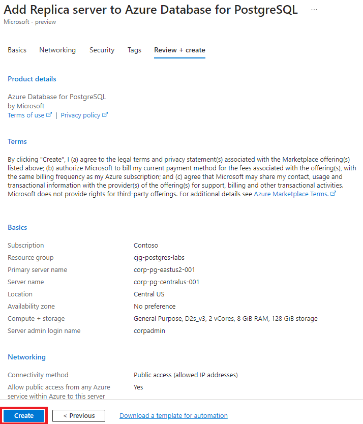

# Create and manage read replicas in Azure Database for PostgreSQL - Flexible Server from the Azure portal

## In this article

- Prerequisities
- Review primary settings
- Create a read replica
- Add virtual endpoints
- Promote replicas
- Monitor a replica
- Delete a replica
- Delete a primary server
- Next steps

### APPLIES TO: Azure Database for PostgreSQL Flexible Server

In this article, you learn how to create and manage read replicas in Azure Database for PostgreSQL Flexible Server from the Azure portal. To learn more about read replicas, see the [overview](https://learn.microsoft.com/en-us/azure/postgresql/flexible-server/concepts-read-replicas).

## Pre-requistes

An [Azure Database for PostgreSQL server](https://learn.microsoft.com/en-us/azure/postgresql/flexible-server/quickstart-create-server-portal) to be the primary server with no current read replicas.

> NOTE: When deploying read replicas for persistent heavy write-intensive primary workloads, the replication lag could continue to grow and may never be able to catch-up with the primary. This may also increase storage usage at the primary as the WAL files are not deleted until they are received at the replica.

## Review primary settings

Before adding a replica for failover purposes, review the target Azure Database for PostgreSQL Flexible Server configuration.  It is a best practice to ensure that your replica configuration values match or exceed your primary configuration.  In some, but not all cases, Azure will attempt to notify you or automaticallu set the necessary values to support promote activites.

### Server configuration

- In the [Azure portal](https://portal.azure.com/), choose the Azure Database for PostgreSQL Flexible Server that you want to setup a replica for.
- On the **Overview** dialog, note the PostgreSQL version (ex `15.3`).  Also note the region your primary is deployed too (ex. `East US`).

  

- On the server sidebar, under **Settings**, select **Compute + storage**.
- Review and note the following settings:

    - Compute: Tier, Processor, Size (ex `Standard_D4ads_v5`).
    - Storage: Storage size (ex `128GB`)
    - High Availability
      - Enabled / Disabled
      - Availability zone settings
    - Backup settings
      - Retention period
      - Redundancy Options

  

> **NOTE** Read replicas are not supported for primary that has **Storage Auto-growth** enabled.  Uncheck this box if it is checked.
    
- Under **Settings**, select **Networking**
- Reviewing the following settings:
    - Public access
    - Firewall rules
      - Allow public access
      - Allowed client ip addresses

### Server parameters

- In the [Azure portal](https://portal.azure.com/), choose the Azure Database for PostgreSQL Flexible Server that you want to create replica for.
- Under **Settings**, select **Server parameters**.

  

- Record any values that you may have modified to support your application.

## Create a read replica

To create a read replica, follow these steps:

- In the [Azure portal](https://portal.azure.com/), choose the Azure Database for PostgreSQL Flexible Server to use as the primary server.
- On the server sidebar, under **Settings**, select **Replication**.
- Select **Create replica**.

  

- Enter the Basics form with the following information.
  - Set the replica server name.
  
  > NOTE: It is a best practice to use a naming convention that will allow you to easily determine what instance you are connecting too or managing and where it resides.

  - Select a location that is different from your primary but note that you can select the same region.

  > NOTE:  To learn more about which regions you can create a replica in, visit the [read replica concepts article](https://learn.microsoft.com/en-us/azure/postgresql/flexible-server/concepts-read-replicas).

  - Set the compute and storage to what you recorded from your primary. If the displayed compute does not match, select **Configure server** and select the appropriate one.
  
  > NOTE:  If you select a compute size smaller than the primary, the deployment will fail. Also be aware that the compute size may not be available in a different region.

    

  - Select an availability zone setting.
  - Notice that the Authentication settings are auto selected for you.

  

- Select **Review + create** to confirm the creation of the replica or **Next: Networking** if you want to add, delete or modify any firewall rules.
- Verify the firewall settings. Notice how the primary settings have been copied automatically.

  

- Leave the remaining defaults and then select the **Review + create** button at the bottom of the page or proceed to the next forms to configure security or add tags.
- Review the information in the final confirmation window. When you're ready, select **Create**. A new deployment will be created and executed.

  

- During the deployment, you will see the primary in `Updating` status:

  

- After the read replica is created, it can be viewed from the Replication window.

  

### Server Parameters

- In the Azure portal, select the replica server.
- On the server sidebar, under **Settings**, select **Server parameters**.
- Set replica server parameters such that they match the priamry server.

> Important: Review the [considerations section of the Read Replica overview](https://learn.microsoft.com/en-us/azure/postgresql/flexible-server/concepts-read-replicas#considerations).

> To avoid issues during promotion of replicas always change the following server parameters on the replicas first, before applying them on the primary: max_connections, max_prepared_transactions, max_locks_per_transaction, max_wal_senders, max_worker_processes.

## Add Virtual Endpoints

- In the Azure portal, select the primary server.
- On the server sidebar, under **Settings**, select **Replication**.
- Select **Create endpoint**
- In the dialog, type a meaningfull name for your endpoint.  Notice the DNS endpoint that is being generated.
- Select **Create**

### Modify application to point to virtual endpoint

Modify any applications that are using your Azure Database for PostgreSQL to use the new virtual endpoint.

## Promote replicas

With all the necessary components in place, you are now ready to perform a promote replica to primary operation.  

> Important: Promotion of replicas cannot be undone. The read replica becomes a standalone server that supports both reads and writes. The standalone server can't be made into a replica again.

To promote replica from the Azure portal, follow these steps:

- In the [Azure portal](https://portal.azure.com/), choose the Azure Database for PostgreSQL Flexible Server primary server.
- On the server sidebar, on the server menu, under **Settings**, select **Replication**
- Under **Servers**, seelct the **Promote** icon for the replica.

  

- In the dialog, ensure the action is **Promote to primary server**.
- For **Data sync**, ensure **Planned - sync data before promoting** is selected.
- Select **Promote**, the process will begin.  Once completed, the roles will be swapped with the replica now the primary and the primary the replica.

### Test applications

Restart your applications, attempt to perform some operations.  The applications should work without any modifying of the virtual endpoint connection string or DNS entries.  This time leave your applications running.

### Failback to original

Repeat the same operations to promote the original server to the primary:

- In the [Azure portal](https://portal.azure.com/), select the replica.
- On the server sidebar, under **Settings**, select **Replication**
- Under **Servers**, seelct the **Promote** icon for the replica.
- In the dialog, ensure the action is **Promote to primary server**.
- For **Data sync**, ensure **Planned - sync data before promoting** is selected.
- Select **Promote**, the process will begin.  Once completed, the roles will be swapped with the replica now the primary and the primary the replica.

### Test appications

Again, switch to one of the consuming applications.  Attempt to perform some operations.

## Monitor a replica

As usage of your instance increased, so too will the amount of time to keep the replica(s) insync.  You can monitor the replication process with Azure Mointor metrics across the primary and the replicas.

### Max Physical Replication Lag

The Max Physical Replication Lag metric shows the lag in bytes between the primary server and the most-lagging replica and is available on the primary.

- In the Azure portal, select the primary server.
- Select **Metrics**. In the Metrics window, select **Max Physical Replication Lag**.

  

- For **Aggregation**, select **Max**.

### Read Replica Lag metric

The Read Replica Lag metric shows the time since the last replayed transaction on a replica. If there are no transactions occurring on your primary, the metric reflects this time lag. For instance if there are no transactions occurring on your primary server, and the last transaction was replayed 5 seconds ago, then the Read Replica Lag will show 5 second delay.  This metric is only available on a replica.

- In the Azure portal, select read replica.
- Select **Metrics**. In the Metrics window, select **Read Replica Lag**.

  

- For **Aggregation**, select **Max**.

## Delete a replica

You can delete a read replica similar to how you delete a standalone Azure Database for PostgreSQL server.

- In the Azure portal, open the **Overview** page for the read replica. Select **Delete**.

  

- On the replica Overview page, select to delete the replica

You can also delete the read replica from the Replication window by following these steps:

- In the Azure portal, select your primary Azure Database for PostgreSQL server.
- On the server menu, under **Settings**, select **Replication**.
- Select the read replica to delete and hit the **Delete** button.

  

- Select the replica to delete
- Acknowledge **Delete** operation.

  

## Delete primary server

You can only delete primary server once all read replicas have been deleted. To delete a server from the Azure portal, follow these steps:

- In the Azure portal, select your primary Azure Database for PostgreSQL server.
- Open the **Overview** page for the server and select **Delete**.

  

- Enter the name of the primary server to delete. Select **Delete** to confirm deletion of the primary server.

  

## Next Steps

- Learn more about [read replicas in Azure Database for PostgreSQL Flexible Server](https://learn.microsoft.com/en-us/azure/postgresql/flexible-server/concepts-read-replicas).
- Replication with Vnet Integration.
