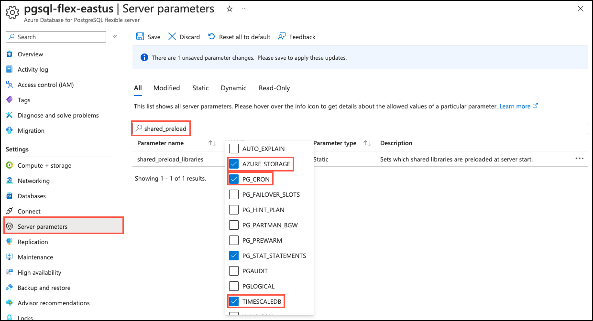

# Hands on Lab: Working with common Postgres extensions

- [Hands on Lab: Working with common Postgres extensions](#hands-on-lab-working-with-common-postgres-extensions)
  - [Exercise 1: Add extensions to allowlist](#exercise-1-add-extensions-to-allowlist)
  - [Exercise 2: Load data into the database from Azure storage using the Azure Storage extension](#exercise-2-load-data-into-the-database-from-azure-storage-using-the-azure-storage-extension)
    - [Task 1: Create an Azure Blob Storage account](#task-1-create-an-azure-blob-storage-account)
    - [Task 2: Create a container](#task-2-create-a-container)
    - [Task 3: Upload data files](#task-3-upload-data-files)
    - [Task 4: Connect to the database using psql in the Azure Cloud Shell](#task-4-connect-to-the-database-using-psql-in-the-azure-cloud-shell)
    - [Task 5: Enable and configure the pg\_azure\_storage extension](#task-5-enable-and-configure-the-pg_azure_storage-extension)
    - [Task 6: Import data from blob storage using the `blob_get` function](#task-6-import-data-from-blob-storage-using-the-blob_get-function)
    - [Task 7: Export data into blob storage using the `blob_put` function](#task-7-export-data-into-blob-storage-using-the-blob_put-function)
  - [Exercise 3: Store geospatial data with the PostGIS extension](#exercise-3-store-geospatial-data-with-the-postgis-extension)
    - [Task 1: Install the PostGIS extension](#task-1-install-the-postgis-extension)
    - [Task 2: Add geospatial column to the listings table](#task-2-add-geospatial-column-to-the-listings-table)
  - [Exercise 3: Set up scheduled jobs](#exercise-3-set-up-scheduled-jobs)
    - [Task 1: Install pg\_cron extension](#task-1-install-pg_cron-extension)
    - [Task 2: Create a rollup table and function](#task-2-create-a-rollup-table-and-function)
    - [Task 3: Create a scheduled task using pg\_cron](#task-3-create-a-scheduled-task-using-pg_cron)
  - [Exercise 4: Add time-series capabilities to the database with the TimescaleDB extension](#exercise-4-add-time-series-capabilities-to-the-database-with-the-timescaledb-extension)
  - [PgBouncer](#pgbouncer)

Azure Database for PostgreSQL Flexible Server provides the ability to extend a database's functionality using [many popular PostgreSQL extensions](https://learn.microsoft.com/azure/postgresql/flexible-server/concepts-extensions). Extensions bundle multiple related SQL objects in a single package that can be loaded or removed from your database with a single command. After being loaded into the database, extensions function like built-in features.

> Important
>
> This lab relies on the Azure Database for PostgreSQL Flexible Server database created in **Hands on Lab 1: Provisioning, configuring, and getting started with development**.

**TODO: Determine what version of Postgres should be used for this lab and the next. V16 does not currently support the `postgis` and `timescaledb` extensions.**

In this lab, you work with the following common PostgreSQL extensions:

| Extension | Description |
| --------- | ----------- |
| [pg_azure_storage](https://learn.microsoft.com/azure/postgresql/flexible-server/reference-pg-azure-storage) | Allows for importing and exporting data in multiple file formats directly between Azure blob storage and an Azure Database for PostgreSQL Flexible Server database. |
| [pg_cron](https://github.com/citusdata/pg_cron) | A cron-based job scheduler that allows you to schedule PostgreSQL commands directly from the database. **??? TODO: Determine if we should use this one in place of PgBouncer (possibly moving PgBouncer content to Lab 2 if there is a desire to cover that functionality, as PgBouncer isn't so much an extension as built-in functionality that can be enabled.)** |
| [postgis](https://www.postgis.net/) | Adds support for storing, indexing, and querying geospatial data (geometry, geography). |
| [timescaledb](https://github.com/timescale/timescaledb) | Provides time-oriented analytical functions, optimizations, and scales Postgres for time-series workloads. |

## Exercise 1: Add extensions to allowlist

Before you can install and use extensions in an Azure Database for PostgreSQL Flexible Server, you must _allowlist_ the desired extensions, as described in [how to use PostgreSQL extensions](https://learn.microsoft.com/azure/postgresql/flexible-server/concepts-extensions#how-to-use-postgresql-extensions).

1. In a web browser, navigate to your Azure Database for PostgreSQL Flexible Server resource in the [Azure portal](https://portal.azure.com/).

2. From the database's left-hand navigation menu, select **Server parameters** under **Settings**, then enter `azure.extensions` into the search box. Expand the **VALUE** dropdown list, then locate and check the box next to each of the following extensions:

    - AZURE_STORAGE
    - PG_CRON (**TODO: Determine if it is okay to use this one in place of PgBouncer.**)
    - POSTGIS
    - TIMESCALEDB

    

    If the extension you are attempting to allowlist is not present in the list, it may not be supported in the version of PostgreSQL you are using. You can review the [supported extension version in the Microsoft docs](https://learn.microsoft.com/azure/postgresql/flexible-server/concepts-extensions#extension-versions). Alternatively, you can run the query, `SELECT * FROM pg_available_extensions;`, against your database.

3. To install some extensions, they must also be included in the server's shared preloaded libraries. Of the extensions you will be using in this lab, `pg_azure_storage`, `pg_cron`, and `timescaledb` need to be preloaded at server start. On the **Server parameters** page, clear the search box and enter `shared_preload` into it. Expand the **VALUE** dropdown list, then locate and check the box next to each of the following extensions:

    **TODO: Determine if this step is actually is necessary for the AZURE_STORAGE and TIMESCALEDB extensions. Is there any documentation or guidance on which extensions this would impact that we can point folks to in the lab? The Azure Storage extension docs don't mention it, but it is in the list on the server parameters page.**

    - AZURE_STORAGE
    - PG_CRON (This should already be check, so just verify that is the case.)
    - TIMESCALEDB

    

4. Select **Save** on the toolbar, then select **Save and Restart** in the dialog that appears.

    

## Exercise 2: Load data into the database from Azure storage using the Azure Storage extension

The [pg_azure_storage extension](https://learn.microsoft.com/azure/postgresql/flexible-server/concepts-storage-extension) enables seamless integration of Azure blob storage with PostgreSQL databases. The extension allows you to import and export data in multiple file formats directly from Azure blob storage and your database.

To use of the `pg_azure_storage` extension for this lab, you first need to provision an Azure Storage account, retrieve its access key, create a container, and copy the sample Seattle Airbnb data files into the container.

### Task 1: Create an Azure Blob Storage account

In this task, you provision an Azure Storage account in the Azure portal to host the sample data files.

1. In a web browser, navigate to the [Azure portal](https://portal.azure.com/).

2. On the portal home page, select **Create a resource** under Azure services.

    

3. On the **Create a resource** page, select **Storage** in the left-hand menu then **Storage account**. You can also use the **Search** functionality to find the resource.

    

4. On the Create a storage account **Basics** tab, enter the following information:

    | Parameter            | Value |
    | -------------------- | ----- |
    | **Project details**  |       |
    | Subscription         | Select the subscription you are using for resources in this lab. |
    | Resource group       | Select the resource group you created in Lab 1. |
    | **Instance details** |       |
    | Storage account name | _Enter a globally unique name_, such as `stpostgreslabs`. |
    | Region               | Select the same region you chose for your Azure Database for PostgreSQL Flexible Server database. |
    | Performance          | Select **Standard**. |
    | Redundancy           | Select **Locally-redundant storage (LRS)**. |

    

5. The default settings will be used for the remaining tabs of the storage account configuration, so select the **Review** button.

6. Select the **Create** button on the **Review** tab to provision the storage account.

### Task 2: Create a container

You have been provided with sample Seattle Airbnb data files in CSV format. To host these files, you will create a container named `seattle-airbnb-data` in the new storage account.

1. Navigate to your new storage account in the [Azure portal](https://portal.azure.com/).

2. In the left-hand navigation menu, select **Containers** under **Data storage**, and then select **+ Container** on the toolbar.

    

3. In the **New container** dialog, enter `seattle-airbnb-data` in the **Name** field and leave **Private (no anonymous access)** selected for the **Public access level** setting, then select **Create**.

    

    By setting the container's access level to **Private (no anonymous access)**, you are preventing public access to the container and its contents. Below, you will provide the `pg_azure_storage` extension with the account name and access key, allowing it to access the files securely.

### Task 3: Upload data files

In this task, you upload the sample Seattle Airbnb data files into it the container you created using the [Azure CLI](https://learn.microsoft.com/cli/azure/).

1. You need the name and key associated with your storage account to upload files using the Azure CLI. In the left-hand navigation menu, select **Access keys** under **Security + networking**.

    

2. With the **Access keys** page open, select the **Cloud Shell** icon in the Azure portal toolbar to open a new Cloud Shell pane at the bottom of your browser window.

    

3. At the Azure Cloud Shell prompt, execute the following `curl` commands to download the Seattle Airbnb data files.

    **TODO: Determine the location from which these files should be downloaded. Public blob storage account or a GitHub location? For now they are in a public storage account hosted by Solliance.**

    ```bash
    curl -O https://solliancepublicdata.blob.core.windows.net/ms-postgresql-labs/listings.csv
    ```

    ```bash
    curl -O https://solliancepublicdata.blob.core.windows.net/ms-postgresql-labs/calendar.csv
    ```

    ```bash
    curl -O https://solliancepublicdata.blob.core.windows.net/ms-postgresql-labs/reviews.csv
    ```

    The above commands download the files into the storage account associated with your Cloud Shell.

4. Next, you will use the [Azure CLI](https://learn.microsoft.com/cli/azure/) to upload the files into the `seattle-airbnb-data` container you created in your storage account. Start by creating variables to hold your storage account name and key values to make things easier.

    Copy your storage account name by selecting the **Copy to clipboard** button next to the storage account name on the Access keys page above your Cloud Shell:

    

    Now, execute the following command at the Cloud Shell prompt to create a variable for your storage account name, replacing the `{your_storage_account_name}` token with your storage account name.

    ```bash
    ACCOUNT_NAME={your_storage_account_name}
    ```

    Next, select the **Show** button next to the **Key** for **key1** and then select the **Copy to clipboard** button next to the key's value.

    

    Then, run the following, replacing the `{your_storage_account_key}` token with the key value you copied.

    ```bash
    ACCOUNT_KEY={your_storage_account_key}
    ```

5. You are now ready to upload the data files. To accomplish this, you will use the [`az storage blob upload`](https://learn.microsoft.com/cli/azure/storage/blob?view=azure-cli-latest#az-storage-blob-upload) CLI command from the Cloud Shell prompt. Run the following commands to upload the three data files into your storage account's `seattle-airbnb-data` container.

    ```bash
    az storage blob upload --account-name $ACCOUNT_NAME --account-key $ACCOUNT_KEY --container-name seattle-airbnb-data --file listings.csv --name listings.csv --overwrite
    ```

    ```bash
    az storage blob upload --account-name $ACCOUNT_NAME --account-key $ACCOUNT_KEY --container-name seattle-airbnb-data --file calendar.csv --name calendar.csv --overwrite
    ```

    ```bash
    az storage blob upload --account-name $ACCOUNT_NAME --account-key $ACCOUNT_KEY --container-name seattle-airbnb-data --file reviews.csv --name reviews.csv --overwrite
    ```

    In this exercise, you are working with a small number of files. You will most likely work with many more files in real-world scenarios. In those circumstances, you can review different methods for [migrating files to an Azure Storage account](https://learn.microsoft.com/azure/storage/common/storage-use-azcopy-migrate-on-premises-data), and select the technique that will work best for your situation.

6. To verify the files uploaded successfully, you can navigate to the **Containers** page of your storage account by selecting **Containers** from the left-hand navigation menu. Select the `seattle-airbnb-data` container from the list of containers and observe that it now contains three files, named `calendar.csv`, `listings.csv`, and `reviews.csv`.

    

### Task 4: Connect to the database using psql in the Azure Cloud Shell

With the files now securely stored in blob storage, it's time to set up the `pg_azure_storage` extension in your database. You will use the `psql` command line utility from the Azure Cloud Shell to accomplish this.

1. Using the same browser tab where the Cloud Shell is open, navigate to your Azure Database for PostgreSQL Flexible Server resource in the [Azure portal](https://portal.azure.com/).

2. From the database's left-hand navigation menu, select **Connect** under **Settings**, then select **airbnb** for the **Database name** and copy the **Connection details** block.

    

3. Paste the connection details into the Cloud Shell, and replace the `{your_password}` token with the password you assigned to the `s2admin` user when creating your database. If the followed the instructions in Lab 1, the password should be `Seattle123Seattle123`.

4. Add one additional environment variable to require an SSL connection to the database.

    ```bash
    export PGSSLMODE=require
    ```

5. Connect to your database using the [psql command-line utility](https://www.postgresguide.com/utilities/psql/) by entering the following at the prompt.

    ```bash
    psql
    ```

    Connecting to the database from the Cloud Shell requires that the `Allow public access from any Azure service within Azure to the server` box is checked on the **Networking** page of the database. If you receive a message that you are unable to connect, please verify this is checked and try again.

### Task 5: Enable and configure the pg_azure_storage extension

Now that you are connected to your database, you can install the `pg_azure_storage` extension. You install extensions using the [CREATE EXTENSION](https://www.postgresql.org/docs/current/sql-createextension.html) command.

1. From the `psql` prompt in the Cloud Shell, run the following command to install the extension in your database:

    ```sql
    CREATE EXTENSION azure_storage;
    ```

    When creating and working with the `pg_azure_storage` extension in your database, note that the extension's name is abbreviated to `azure_storage`.

2. With the extension now installed, you are ready to configure the extension to connect to your storage account. You will need the name and key associated with your storage account. Using the same browser tab where the Cloud Shell is open, navigate to your storage account resource in the [Azure portal](https://portal.azure.com/). In the left-hand navigation menu, select **Access keys** under **Security + networking**.

    

3. Before you can import data from blob storage, you need to map to the storage account using `account_add` method, providing the account access key defined when account was created. At the `psql` prompt, execute the following command after replacing the `{your_storage_account_name}` and `{your_storage_account_key}` tokens with the **Storage account name** and **Key** values, respectively.

    ```sql
    SELECT azure_storage.account_add('{your_storage_account_name}', '{your_storage_account_key}');
    ```

4. Once your storage account has been mapped, you can list the storage account contents. After replacing the `{your_storage_account_name}` token with the **Storage account name**, run the following command to view the list of files in the `seattle-airbnb-data` container:

    ```sql
    SELECT path, bytes, pg_size_pretty(bytes), content_type
    FROM azure_storage.blob_list('{your_storage_account_name}', 'seattle-airbnb-data');
    ```

    The `blob_list` function output should be similar to the following:

    

### Task 6: Import data from blob storage using the `blob_get` function

With the `pg_azure_storage` extension now connected to your blob storage account, you are ready to import the data it contains into your database. To import data using the extension, you can use the [blob_get function](https://learn.microsoft.com/azure/postgresql/flexible-server/concepts-storage-extension#import-data-using-blob_get-function). Using the queries below, you will create tables in the database for storing the data and then import data from the files in blob storage using the `pg_azure_storage` extension.

1. Before importing data, you must create tables to store data from the CSV files. Run each of the commands below to create the three required table. The table structures are based on the columns defined in each file.

    ```sql
    CREATE TABLE calendar
    (
        listing_id bigint,
        date date,
        available boolean,
        price text
    );
    ```

    ```sql
    CREATE TABLE listings
    (
        id bigint PRIMARY KEY,
        listing_url text,
        scrape_id bigint,
        last_scraped date,
        name text,
        summary text,
        space text,
        description text,
        experiences_offered text,
        neighborhood_overview text,
        notes text,
        transit text,
        thumbnail_url text,
        medium_url text,
        picture_url text,
        xl_picture_url text,
        host_id bigint,
        host_url text,
        host_name text,
        host_since date,
        host_location text,
        host_about text,
        host_response_time text,
        host_response_rate text,
        host_acceptance_rate text,
        host_is_superhost boolean,
        host_thumbnail_url text,
        host_picture_url text,
        host_neighbourhood text,
        host_listings_count int,
        host_total_listings_count int,
        host_verifications text,
        host_has_profile_pic boolean,
        host_identity_verified boolean,
        street text,
        neighbourhood text,
        neighbourhood_cleansed text,
        neighbourhood_group_cleansed text,
        city text,
        state text,
        zipcode text,
        market text,
        smart_location text,
        country_code text,
        country text,
        latitude float,
        longitude float,
        is_location_exact boolean,
        property_type text,
        room_type text,
        accommodates int,
        bathrooms real,
        bedrooms int,
        beds int,
        bed_type text,
        amenities text,
        square_feet int,
        price text,
        weekly_price text,
        monthly_price text,
        security_deposit text,
        cleaning_fee text,
        guests_included int,
        extra_people text,
        minimum_nights int,
        maximum_nights int,
        calendar_updated text,
        has_availability boolean,
        availability_30 int,
        availability_60 int,
        availability_90 int,
        availability_365 int,
        calendar_last_scraped date,
        number_of_reviews int,
        first_review date,
        last_review date,
        review_scores_rating int,
        review_scores_accuracy int,
        review_scores_cleanliness int,
        review_scores_checkin int,
        review_scores_communication int,
        review_scores_location int,
        review_scores_value int,
        requires_license boolean,
        license text,
        jurisdiction_names text,
        instant_bookable boolean,
        cancellation_policy text,
        require_guest_profile_picture boolean,
        require_guest_phone_verification boolean,
        calculated_host_listings_count int,
        reviews_per_month numeric
    );
    ```

    ```sql
    CREATE TABLE reviews
    (
        listing_id bigint,
        id bigint PRIMARY KEY,
        date date,
        reviewer_id bigint,
        reviewer_name text,
        comments text
    );
    ```

2. You are now ready to import data using the `pg_azure_storage` extension. Starting with the `calendar.csv` file, use the `blob_get` function with the [azure_storage.options_csv_get](https://learn.microsoft.com/azure/cosmos-db/postgresql/reference-pg-azure-storage#azure_storageoptions_csv_get) utility function to specify the decoding options for the CSV file. The `blob_get` function retrieves a file from blob storage. In order for `blob_get` to know how to parse the data you can explicitly define the columns in the `FROM` clause. Run the following command to import data from the file. Be sure to replace the `{your_storage_account_name}` token with your storage account name.

    ```sql
    INSERT INTO calendar
    SELECT * FROM azure_storage.blob_get('{your_storage_account_name}', 'seattle-airbnb-data', 'calendar.csv', options:= azure_storage.options_csv_get(header=>true)) AS cal_rec (
        listing_id bigint,
        date date,
        available boolean,
        price text
    );
    ```

    Note the `price` column is assigned a `text` data type in the table. This is because the CSV file contains dollar signs (`$`) and commas (`,`) in some of the values. You will correct this below to allow numeric operations to occur on the field.

3. With the data imported, you can now fix the data type associated with the `price` column so numeric operations can be conducted on the column.

    ```sql
    ALTER TABLE calendar ALTER column price TYPE numeric USING (REPLACE(REPLACE(price, ',', ''), '$', '')::numeric);
    ```

4. Above, you explicitly defined the columns in the `calendar.csv` file in the `FROM` clause in the `blob_get` function. Alternatively, you can pass a value (`NULL::table_name`), which infers the columns of the file based on the table definition. This is especially useful when the target table has many columns, as with the `listings` table. Note, this requires the file and table to have the same structure. Run the following command to import the `listings` data from the file. Be sure to replace the `{your_storage_account_name}` token with your storage account name.

    ```sql
    INSERT INTO listings
    SELECT * FROM azure_storage.blob_get('{your_storage_account_name}','seattle-airbnb-data','listings.csv', NULL::listings,options:= azure_storage.options_csv_get(header=>true));
    ```

5. Run the following command to import `reviews` data from blob storage. Be sure to replace the `{your_storage_account_name}` token with your storage account name.

    ```sql
    INSERT INTO reviews
    SELECT * FROM azure_storage.blob_get('{your_storage_account_name}','seattle-airbnb-data','reviews.csv', NULL::reviews,options:= azure_storage.options_csv_get(header=>true));
    ```

6. Run a few queries to verify the data loaded into each table:

    ```sql
    SELECT * FROM calendar WHERE price BETWEEN 100 AND 125 LIMIT 10;
    ```

    ```sql
    SELECT COUNT(id) FROM listings WHERE neighbourhood_group_cleansed = 'Ballard';
    ```

    ```sql
    SELECT listing_id, date, reviewer_name, comments FROM reviews WHERE listing_id = 7202016 LIMIT 3;
    ```

### Task 7: Export data into blob storage using the `blob_put` function

The `pg_azure_storage` extension also allows data to be exported from an Azure Database for PostgreSQL to Azure blob storage. In the task, you will export the cleansed `calendar` data back to blob storage.

1. Above, you fixed the data type associated with the `price` column in the `calendar` table by cleaning up unwanted characters from the `text` column and then assigning a `numeric` data type to the column. To push the updated data back into blob storage, you can use the following command. Be sure the replace the `{your_storage_account_name}` token with the name of your storage account before running the query.

    ```sql
    SELECT azure_storage.blob_put('{your_storage_account_name}', 'seattle-airbnb-data', 'calendar.csv', cal_rec)
    FROM (SELECT listing_id, date, available, price FROM calendar) cal_rec;
    ```

2. After the query completes, navigate to your storage account in the [Azure portal](https://portal.azure.com/), select **Containers** under **Data storage** in the left-hand menu, select the **seattle-airbnb-data** container and then download the `calendar.csv` file.

3. Open the file and observe that data in the `price` column not longer contains dollar signs (`$`) or commas (`,`) and that the rows with values contain a numeric value.

## Exercise 3: Store geospatial data with the PostGIS extension

[PostGIS](https://www.postgis.net/) is a 3rd party open-source spatial database extender for PostgreSQL object-relational databases, which adds support for geographic objects that allow location queries to be run in SQL. This extension enables complex geospatial queries and analysis within PostgreSQL, essential for mapping, location tracking, and spatial analysis. It provides a variety of spatial data types, indexing options, and functions to efficiently query and manipulate geospatial data.

### Task 1: Install the PostGIS extension

To install the `postgis` extension in your database, use the [CREATE EXTENSION](https://www.postgresql.org/docs/current/static/sql-createextension.html) command, as you did with the `pg_azure_storage` extension. Behind the scenes, executing `CREATE EXTENSION` runs the extension's script file. The script typically creates new SQL objects such as functions, data types, operators, and index support methods. Additionally, `CREATE EXTENSION` records the identities of all the created objects so that they can be dropped again if `DROP EXTENSION` is issued.

1. Run the `CREATE EXTENSION` command to install the `postgis` extension in your database.

    ```sql
    CREATE EXTENSION IF NOT EXISTS postgis;
    ```

    If you attempt to install an extension with the same name as one already loaded in the database, you will receive an error that the extension already exists. Specifying the `IF NOT EXISTS` clause when running the `CREATE EXTENSION` command allows you to avoid this error.

### Task 2: Add geospatial column to the listings table

With the `PostGIS` extension now loaded, you are ready to begin working with geospatial data in the database. The `listings` table you created and populated above contains the latitude and longitude of all listed properties. To use these data for geospatial analysis, you need to alter the `listings` table to add a `geometry` column that accepts the `point` data type. These new data types are included in the `postgis` extension.

1. To accommodate `point` data, you must add a new `geometry` column to the table that accepts `point` data:

    ```sql
    ALTER TABLE listings
    ADD COLUMN listing_location geometry(point, 4326);
    ```

2. Next, update the table with geospatial data associated with each listing.

    ```sql
    UPDATE listings
    SET listing_location = ST_SetSRID(ST_Point(longitude, latitude), 4326);
    ```

3. Run the following query to view the data stored in the `listing_location` column:

    ```sql
    SELECT id, listing_location FROM listings LIMIT 10;
    ```

4. With your listing records updated, use the `ST_X(point)` and `ST_Y(point)` functions loaded by `postgis` to view the geospatial data that was inserted:

    ```sql
    SELECT id, name, street, ST_X(listing_location) AS longitude, ST_Y(listing_location) AS latitude
    FROM listings
    LIMIT 10;
    ```

## Exercise 3: Set up scheduled jobs

[pg_cron](https://github.com/citusdata/pg_cron) is a simple, cron-based job scheduler for PostgreSQL that runs inside the database as an extension. This powerful and simple extension can be used for many tasks, including aggregating data in near-real time, database cleanup and administrative tasks, and much more.

Extending your database with the [pg_cron](https://github.com/citusdata/pg_cron) extension allows you to schedule PostgreSQL commands directly from the database using a cron-based job scheduler. Using this extension, you can schedule a job that calls a function to execute on a schedule, such as every month, hour, or minute. In this exercise, you will create a scheduled task in the database to compute monthly rollups of reviews per listing.

### Task 1: Install pg_cron extension

To install the `pg_cron` extension, you need to disconnect from the `airbnb` database and reconnect to the `postgres` database on your Azure Database for PostgreSQL Flexible Server.

1. Run the `CREATE EXTENSION` command to install the `pg_cron` extension in your database.

    **TODO: Determine if we can work past this error... Possible work-around is the use the `postgres` database for everything and not create an `airbnb` database.**

    ```bash
    airbnb=> CREATE EXTENSION IF NOT EXISTS pg_cron;
    ERROR:  can only create extension in database postgres
    DETAIL:  Jobs must be scheduled from the database configured in cron.database_name, since the pg_cron background worker reads job descriptions from this database.
    HINT:  Add cron.database_name = 'airbnb' in postgresql.conf to use the current database.
    CONTEXT:  PL/pgSQL function inline_code_block line 4 at RAISE
    ```

    ```sql
    CREATE EXTENSION IF NOT EXISTS pg_cron;
    ```

### Task 2: Create a rollup table and function

1. To get started, you need to create a rollup table to store the aggregate data:

    ```sql
    CREATE TABLE rollup_reviews (
       listing_id bigint,
       month date,
       review_count bigint
    );
    ```

2. Next, create a unique constraint on `listing_id` and `month`.

    ```sql
    CREATE UNIQUE INDEX rollup_reviews_unique_idx ON rollup_reviews(listing_id, month);
    ```

3. For the rollup, you will use an `INSERT ... SELECT` command to load the aggregated data into the rollup table. To simplify calling the query to perform the data aggregation, create a function to perform the rollup:

    ```sql
    CREATE OR REPLACE FUNCTION compute_review_rollups(start_time date, end_time date)
    RETURNS void LANGUAGE PLPGSQL AS $function$
    BEGIN
       RAISE NOTICE 'Computing monthly rollups from % to % (excluded)', start_time, end_time;
    
    RAISE NOTICE 'Aggregating event data into monthly rollup table';
    INSERT INTO rollup_reviews
    SELECT listing_id,
       date_trunc('month', date) as month,
       count(*) AS review_count
    FROM reviews
    WHERE date >= start_time AND date <= end_time
    GROUP BY listing_id, month
    ON CONFLICT (listing_id, month)
       DO UPDATE SET review_count = rollup_reviews.review_count + excluded.review_count;
    
    END;
    $function$;
    ```

4. Run the following query to trigger your function to roll up the last month of data in the database:

    ```sql
    SELECT compute_review_rollups(date '2015-12-01',date '2016-01-03');
    ```

5. To view the results of the function call, run the following query:

    ```sql
    SELECT * FROM rollup_reviews ORDER BY review_count DESC LIMIT 10;
    ```

### Task 3: Create a scheduled task using pg_cron

1. The final step for setting up the scheduled task is to automate the rollups using the `pg_cron` extension. Execute the following query using the `cron.schedule()` function to schedule the job to run at the top of every hour of every day (`0 * * * *`).

    ```sql
    SELECT cron.schedule('0 * * * *', $$SELECT compute_review_rollups(date '2009-06-07',date '2016-01-13');$$);
    ```

2. **TODO: Add step to view the output of the job...**

3. If you need to stop the job, query the `cron.job` table to retrieve the `jobid` of your job:

    ```sql
    SELECT * FROM cron.job;
    ```

4. Then, unschedule the job using the following, replacing the `{job_id}` token with the `jobid` you retrieved from the previous query.

    ```sql
    SELECT cron.unschedule({job_id});
    ```

## Exercise 4: Add time-series capabilities to the database with the TimescaleDB extension

**TODO: Add info about the extension and finish this exercise...**

`timescaledb`

1. Install extension:

    ```sql
    CREATE EXTENSION IF NOT EXISTS timescaledb CASCADE;
    ```

2. Create Hypertable.

    Hypertables are PostgreSQL tables that automatically partition your data by time. You interact with hypertables in the same way as regular PostgreSQL tables, but with extra features that makes managing your time-series data much easier.

Time-Series Data Optimization: Enhances PostgreSQL for handling time-series data, offering better query performance and efficient data storage for time-stamped information.

Scalability and Data Retention: Facilitates easy scaling for large datasets and provides efficient data retention policies, ideal for IoT, monitoring, and analytics applications.

TimescaleDB is developed by Timescale. It is an open-source extension but also offers a proprietary version with additional features.

## PgBouncer

TODO: Consider moving this to Lab 2, as it is less an extension and more a built-in capability that can be enabled if desired.

https://learn.microsoft.com/en-us/azure/postgresql/flexible-server/concepts-pgbouncer

To enable, see the below. Note that this isn't configured and enabled in the same way as other extensions, so perhaps ask if this should be something Chris covers in lab 2, and we focus on another extension (`pg_cron`, for example) in this article.

https://learn.microsoft.com/en-us/azure/postgresql/flexible-server/concepts-pgbouncer#enabling-and-configuring-pgbouncer

Connection Pooling: Reduces resource overhead by managing a pool of connections to PostgreSQL, making it ideal for environments with high concurrency and frequent short-lived connections.

Performance Optimization: Helps in improving application performance and database efficiency by reducing the load on PostgreSQL server caused by too many connections.

PgBouncer is a 3rd party an open-source, community-developed project.
